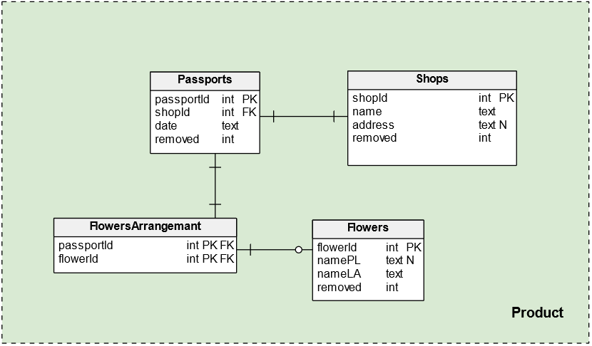
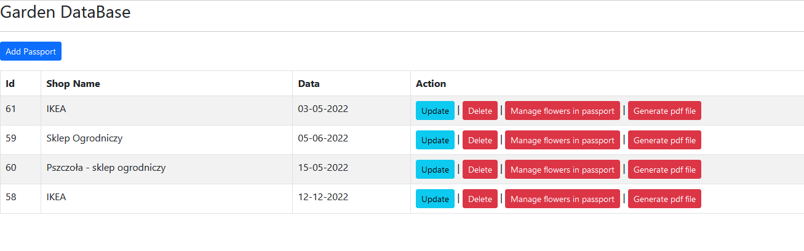
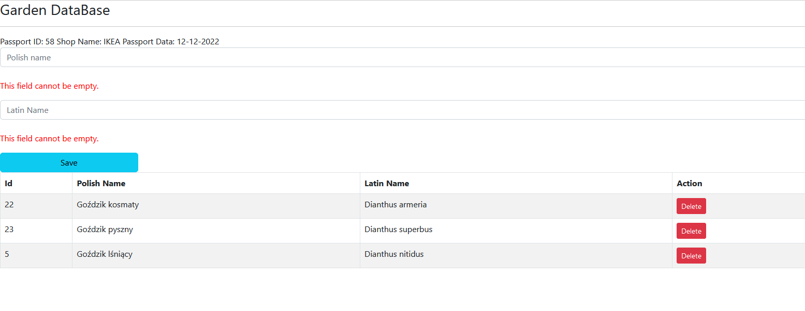
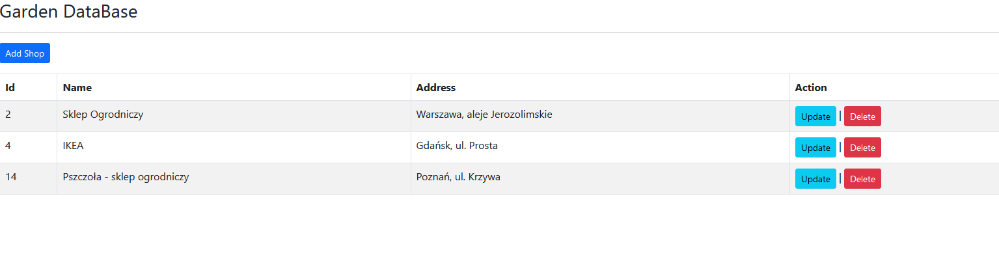
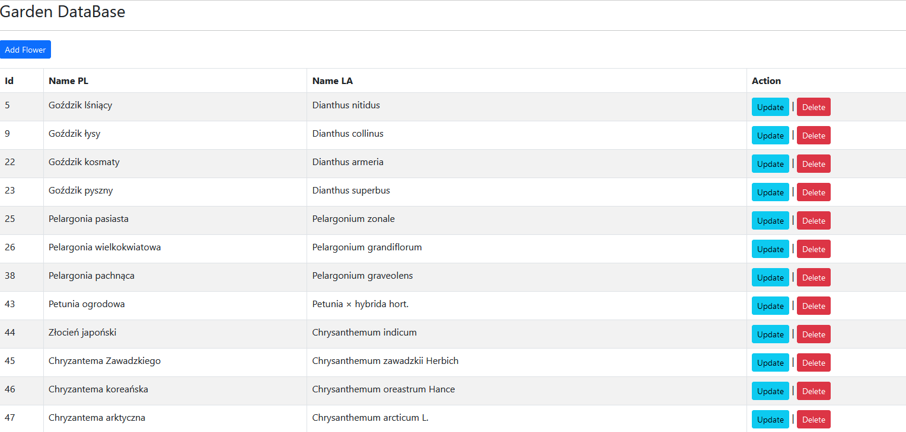

# GARDEN DATA BASE

**GARDEN DATA BASE** is an app to store EU Plants Passports and create new.

**Status** - Work in progres.

## Table of contents

* Author
* Technologies
* General info

## Author
[Marek Frańczak](https://github.com/marekfranczak)

## Technologies
* Java 17 [Object-oriented programming language] (https://www.java.com/)
* IntelliJ IDEA 2022.2.3 [Java IDE] (https://www.jetbrains.com/idea/)
* SpringBoot [Java framework for building web applications] (https://openjfx.io/)
* MySQL [Database engine] (https://www.mysql.com/)
* Thymeleaf [HTML/XML template engine] (https://www.thymeleaf.org/)

## General info
**1.0** - app work with SQLite and JavaFX. Desktop application. Finished.

**2.0** - old database SQLite will be replaced with MySql database. App will work on MVC Spring architecture. Finished.

**2.1** - add a REST controller so that the program can be operated through dedicated websites. Work in progres.

**2.2** - add new features as customized database tables, main page. Change the template engine to vaadin. Plans for future.

**3.0** - App will be published on AWS. Propable change of database. Plans for future.

**Database diagram**

**Overview passports**

**Creating passport**

**Overview shops**

**Overview flawers**

## License
For open source projects, say how it is licensed.
